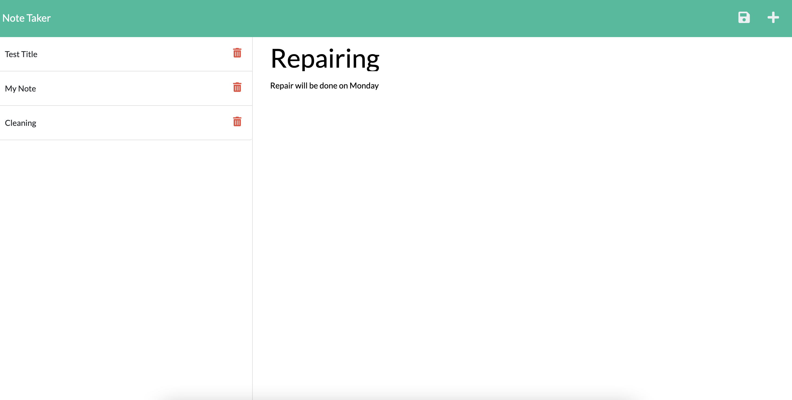

# Note Taker

## Description
Create NOTES
## Installation
npm start
## Usage
Create a note
## License
Apache
## Badges

## Contributing
Gulcin Dedeoglu
## Questions
https://github.com/gulchintory
avgulcin@gmail.com

# Website Link
https://gulchintory.github.io/note-taker/

# Github Repo Link
https://github.com/gulchintory/note-taker

# Screenshot

